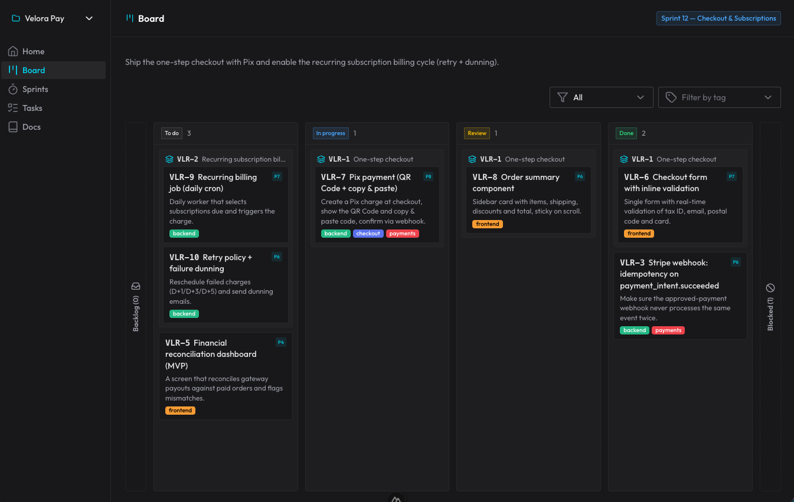
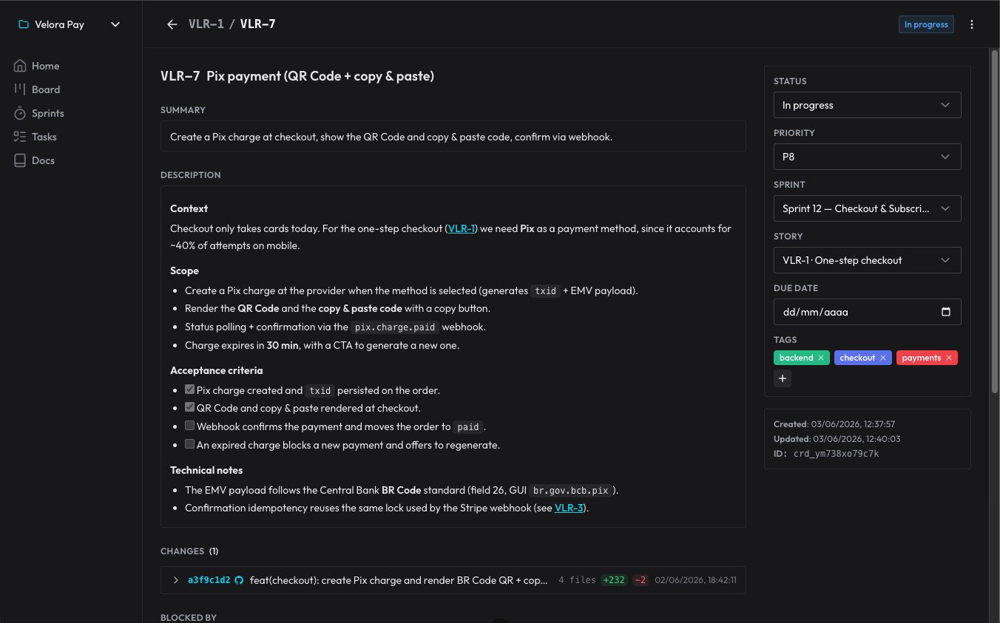
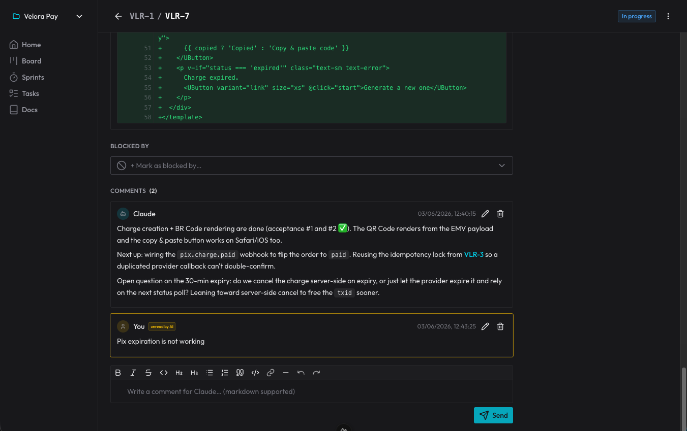

<div align="center">

# Claude Organizer

### A "Jira" for Claude Code — your agent's project board, exposed over MCP.

Claude Organizer gives Claude Code a real project-management system — cards,
sprints, roadmaps, comments and docs — as **queryable state over MCP**, instead
of spec Markdown files that grow without bound and go stale. A clean Nuxt UI
mirrors the same board for humans, in real time.

It ships as a **Claude Code plugin** (five skills + the MCP server), backed by a
pnpm monorepo you run with Docker.

<br/>

[](LICENSE)


<br/>



</div>

---

## Why

A long-running coding agent has no memory between sessions. The usual fix —
piling plans and decisions into ever-growing `.md` files — rots fast: the files
drift from reality, contradict each other, and bloat the context window.

Claude Organizer flips that. **What** to do (the active sprint, cards, backlog,
comments, decisions, docs) lives in a database the AI queries on demand through
MCP tools, and edits as work progresses. The agent orients itself at the start
of every session by reading the board — not by re-reading stale prose. You watch
the same board, drag cards, and leave comments the agent reads back.

## Highlights

- 🗂️ **A real board** — projects, sprints, stories and sub-tasks, blockers,
  tags, priorities. Drag-and-drop UI with live WebSocket updates.
- 🤖 **Built for the agent** — every entity is a typed MCP tool; prefixed IDs
  (`prj_`, `crd_`, `spr_`…) tell the AI what it's holding at a glance.
- 💬 **Comments as the decision log** — the agent records *why* it did something
  on the card; you reply, it reads your unread comments back next session.
- 🔗 **Commits attached to cards** — each card keeps the diff that delivered it,
  captured outside the AI's context (no tokens spent reading patches).
- 📚 **Docs that don't rot** — architecture, ADRs and patterns live as project
  docs the agent reads before reinventing.
- 🔌 **One-command install** — the plugin delivers the skills *and* registers the
  remote MCP; no `claude mcp add`.

<div align="center">
<table>
<tr>
<td width="50%"></td>
<td width="50%"></td>
</tr>
<tr>
<td align="center"><sub>Card detail — description, acceptance criteria, status & the attached commit.</sub></td>
<td align="center"><sub>The commit diff plus the comment thread — the agent's decision log.</sub></td>
</tr>
</table>
</div>

## Quick start

> **Requires** Node 20.10+, pnpm 9+, and Docker.

### 1. Bring up the stack

Postgres + migrations + API + UI + MCP, in one shot:

```bash
git clone https://github.com/fmilioni/claude-organizer.git
cd claude-organizer
cp .env.example .env
docker compose up -d --build
```

| Service | URL |
| --- | --- |
| **Web UI** | http://localhost:4401 |
| **API** | http://localhost:4400 |
| **MCP** (Streamable HTTP) | http://localhost:4402/mcp |

Migrations run automatically before the API and MCP start. Postgres data persists
under `./docker/data/postgres`.

### 2. Configure the environment

`cp .env.example .env` already gives you working defaults for local Docker. The
values worth knowing:

```bash
# Postgres
POSTGRES_USER=organizer
POSTGRES_PASSWORD=organizer
POSTGRES_DB=organizer
POSTGRES_PORT=5544                 # host port (in-container is 5432)

# API & Web
API_PORT=4400
NUXT_PUBLIC_API_URL=http://127.0.0.1:4400

# MCP transport
# MCP_HTTP_PORT=4402               # serve over HTTP (Docker/VPS); omit for stdio
# MCP_AUTH_TOKEN=                  # if set, clients must send Authorization: Bearer <token>
```

The MCP runs over **stdio** by default (local Claude Code). Setting
`MCP_HTTP_PORT` serves it over Streamable HTTP at `/mcp` instead — that's what the
Docker stack does, and it's the transport the plugin connects to.

### 3. Install the plugin

The plugin delivers the **skills** *and* registers the **MCP** — no
`claude mcp add` needed.

From a clone:

```bash
claude --plugin-dir plugins/claude-organizer
```

Or via the marketplace:

```text
/plugin marketplace add fmilioni/claude-organizer
/plugin install claude-organizer@claude-organizer
```

The `claude-organizer` tools appear automatically, pointing at
`${CO_MCP_URL:-http://localhost:4402/mcp}`. If the server sets `MCP_AUTH_TOKEN`,
pass it as `CO_MCP_TOKEN`.

## The skills

Five skills drive the work — you don't call them by hand, they trigger from what
you say:

| Skill | What it does | Triggers when… |
| --- | --- | --- |
| **`claude-organizer`** | Orient & operate the board: read the active sprint, unread comments, keep statuses honest, write docs. | the start of any session — *"let's continue", "what's next?"* |
| **`plan`** | Turn a fuzzy new demand into structured work (sprint → stories → tasks), gets the design approved, then creates the cards. | you describe something new to build, before it's broken down. |
| **`implement`** | Execute one existing card through its lifecycle: `in_progress` → read comments → implement → review → commit → `done`. | you start/resume work on a specific card — *"work CO-42", "build it"*. |
| **`review`** | A mandatory review gate (per-task + story-level), run by a fresh subagent: checks acceptance criteria, hunts bugs/security/reuse. | a task or story's last task just finished (fired by `implement`). |
| **`autopilot`** | Run the board autonomously — advance through several ready cards as **independent PRs off `main`**, guided by the blocker graph. Never merges; your merge is the gate. | you ask it to run the board on its own. |

## Using it

Just talk to Claude Code.

**Plan a new demand** — the `plan` skill:

> **You:** I want to add CSV export to the board — a button that downloads the
> active sprint's cards.
>
> **Claude:** *asks a couple of questions, proposes a breakdown into a sprint +
> tasks, and on your OK creates the cards.*

**Continue later** — the `claude-organizer` + `implement` skills. A fresh session
has no memory, so it reads the board before touching code:

> **You:** let's continue — what's next?
>
> **Claude:** *reads the active sprint, your unread comments and the in-flight
> cards, picks the top one, moves it to `in_progress`, implements it, records the
> decisions as comments, runs the review gate, then moves it to `review` for you.*

**Let it run** — the `autopilot` skill works several ready cards as separate PRs
and stops when only blocked/PR-dependent work remains. Your merge confirms each.

## Architecture

```text
Claude Code ──HTTP──▶ MCP (:4402/mcp) ─┐
                                       ├─▶ core ──▶ Postgres 16
Browser (SPA) ──HTTP──▶ API (:4400) ───┘   (+ WebSocket /ws for real-time)
```

A pnpm monorepo under `packages/`:

| Package | Role |
| --- | --- |
| `shared` | Shared TypeScript types. |
| `db` | Drizzle schema + migrations. |
| `core` | Zod-validated use-cases — the single source of truth. |
| `mcp` | The MCP server (stdio or HTTP). |
| `api` | Fastify REST + WebSocket. |
| `web` | Nuxt 4 SPA (the UI talks only to the API, never the MCP). |

Prefixed nanoid IDs (`prj_`, `crd_`, `spr_`…) let the agent recognize an entity's
type from the ID alone.

## Remote (VPS)

Host the stack, then point Claude Code at it before launching:

```bash
CO_MCP_URL=https://your-host/mcp CO_MCP_TOKEN=your-token claude
```

`CO_MCP_TOKEN` is only needed when the server sets `MCP_AUTH_TOKEN`. Terminate TLS
with a reverse proxy (Caddy, Nginx, …).

## Development (without Docker)

```bash
pnpm install
pnpm db:up                       # Postgres on :5544
pnpm db:migrate
pnpm dev:api                     # :4400
pnpm dev:web                     # :4401
MCP_HTTP_PORT=4402 pnpm dev:mcp  # :4402  (omit MCP_HTTP_PORT for stdio)
```

Also handy: `pnpm typecheck`, `pnpm lint`, `pnpm test`, and `pnpm db:generate`
after schema changes.

## Roadmap

Claude Organizer is single-tenant and open today — anyone who can reach the API
or MCP can read and write the board. The next milestone closes that gap:

- 🔐 **Authentication & accounts** — sign-in for the web UI and token-based auth
  for the API, so the board is no longer wide-open.
- 👥 **Multi-user & roles** — per-user identity on cards and comments, with
  owner / member / viewer permissions.
- 🏢 **Multi-tenant workspaces** — isolated organizations, each with its own
  projects, members and MCP credentials.
- 🔑 **Scoped MCP tokens** — per-agent tokens with project-level scope, instead
  of a single shared `MCP_AUTH_TOKEN`.
- 📦 **Import / export** — back up and move a board between instances, with a
  portable format to export projects, sprints, cards, comments and docs (and
  import them back).

> Today, protect a hosted instance by keeping it private (VPN / reverse-proxy
> auth) and setting `MCP_AUTH_TOKEN`. Real authentication lands with the items
> above.

## License

[MIT](LICENSE) © Felipe Milioni
</content>
</invoke>
